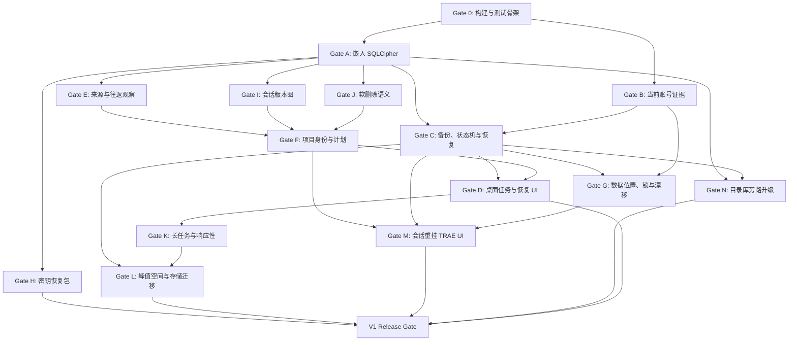

# Trae Sync V1 Gate 计划

版本：`0.1`

状态：基于 D-001 至 D-045；尚未开始程序实现。

## 1. 目的

Gate 用于证明功能真实可用和数据不会因工具操作丢失。每个 Gate 都有明确 fixture、步骤、通过条件、证据和停止规则。

研究脚本、mock、源代码推断和真实运行证据必须分开记录。低层 Gate 未通过时，不开始依赖它的真实写入功能。

## 2. 证据等级

```text
Research    代码、schema、日志或手工副本实验已证明方向可行
Implemented 生产模块和自动测试已完成
Qualified  在要求的真实或隔离环境中通过完整 Gate
```

只有 `Qualified` 能解锁发布能力。

## 3. 通用规则

1. 所有数据库写实验先使用经过哈希验证的副本。
2. 不把活动 TRAE 数据库作为开发 fixture。
3. 真实库验收必须在所有前置 Gate 通过后，由用户明确批准一次。
4. 每次 Gate 记录产品版本、应用版本、schema、SQLCipher、OS、文件哈希和精确命令。
5. 不把 Token、cookies、认证密文正文、目录库明文密钥或恢复密码写入证据。
6. 失败结果也保留；修复后新建一次运行，不覆盖旧证据。
7. mock 只证明 UI 或编排接口，不能替代文件、SQLCipher、崩溃和 TRAE UI 证据。
8. Gate 未通过时，对应能力保持禁用或只读。

## 4. Gate 证据目录

未来项目使用：

```text
evidence/gates/<gate-id>/<run-id>/
  REPORT.md
  environment.json
  commands.ps1
  assertions.json
  hashes.sha256
  logs/                  已去除认证正文
  screenshots/           需要 UI 证据时
```

大型真实数据库副本不提交到仓库。`REPORT.md` 记录其本地 fixture ID、来源快照 ID、大小和 SHA-256。

每份报告必须包含：

```text
结论：PASS / FAIL / BLOCKED
证据等级
前置 Gate
测试范围
未验证内容
失败后的目标和备份状态
复现命令
```

## 5. 依赖关系



## 6. 当前状态

| Gate | 当前证据 | 状态 |
| --- | --- | --- |
| 0 | 尚无项目代码 | Not started |
| A | SQLCipher CLI 已打开真实副本，兼容性和副本事务已验证 | Research |
| B | 10 个真实启动会话和产品代码已验证账号来源 | Research |
| C | 仅有设计和一次人工备份/迁移经验 | Not started |
| D | 仅有信息架构 | Not started |
| E | 已有一次账号迁移，未做完整往返扫描 | Research partial |
| F | 已发现同路径不同语义项目，会话计划尚未实现 | Research partial |
| G | 已发现默认位置和第三方切换行为，未做并发 Gate | Research partial |
| H | 仅有设计 | Not started |
| I | 内容闭包哈希实验已完成，规范化版本分类未实现 | Research partial |
| J | 已识别软删除需求，fixture 未完成 | Not started |
| K | 已知真实库约 257 MB，应用性能未测 | Research partial |
| L | 仅有预算和迁移设计 | Not started |
| M | 数据库副本重挂通过，TRAE UI 继续对话未验证 | Research partial |
| N | 仅有旁路升级设计 | Not started |

## 7. Gate 0：构建与测试骨架

### 目标

证明新项目可重复构建、测试和打包，并建立不会误写真实数据的测试边界。

### 必须完成

- Tauri 2 + Rust + React + TypeScript + Vite 最小应用。
- Domain 与 Tauri command 分离。
- Rust 单元/集成测试、前端测试和格式检查命令。
- `fixture_root` 只能指向测试目录的强约束。
- 测试构建中拒绝把已发现的默认 TRAE 活动路径作为写目标。
- 结构化日志、`operation_id` 和去敏诊断基础。
- Windows x64 开发构建和安装包构建。

### 通过条件

```text
全新 checkout 可按文档构建
Rust、TypeScript、前端测试全部通过
测试写入默认 TRAE 路径被拒绝
最小安装包可启动并显示空工作台
```

### 停止规则

构建不可重复、测试可能命中真实路径或核心依赖 Tauri 时，不进入 Gate A/B。

## 8. Gate A：嵌入 SQLCipher

### 目标

证明生产 Rust 连接层能打开 Work CN 和 Trae Sync 两类 SQLCipher 数据库，不依赖外部 CLI 或 TRAE DLL。

### Fixture

- 已验证 Work CN DB/WAL/SHM 副本。
- 含未 checkpoint WAL 的副本。
- 错误 key、截断文件、未知 schema 副本。
- 新建 Trae Sync 随机密钥目录库。

### 验证

1. 固定 Rust SQLite/SQLCipher 依赖并记录构建特性。
2. 校验 `cipher_version`、key 语法和关键 PRAGMA。
3. 只读打开 Work CN 副本并读取 schema 指纹和已知数量。
4. 通过 SQLite Backup API 生成单文件逻辑副本。
5. 在测试副本执行项目归属事务、回滚和提交。
6. 新连接重新打开并运行两层完整性检查。
7. 创建、关闭、重开 Trae Sync 随机密钥目录库。
8. 从打包后的 Tauri 后端重复关键检查。

### 通过条件

```text
真实副本关键数量与研究基线一致
未 checkpoint WAL 的已提交记录进入逻辑副本
错误 key 和未知 schema 明确失败且零写入
提交与回滚结果符合断言
cipher_integrity_check 无错误
integrity_check = ok
打包程序无需系统 SQLCipher 安装
```

### 停止规则

无法固定兼容构建、Backup API 丢失 WAL 内容、打包后 ABI 变化或完整性检查不稳定时，阻止所有 DB 功能。

## 9. Gate B：当前账号证据

### 目标

把已完成的真实格式调查实现为不保存凭证的生产解析器。

### Fixture

- 从两个账号真实日志中提取的最小白名单事件；不保留同文件内其他认证或请求内容。
- 与 `tc` 头部和 Base64 形态一致的合成认证字段，用于指纹与格式测试；真实认证正文不进入仓库 fixture。
- 账号管理器写入的明文兼容认证对象，Token 字段使用测试值。
- `state.vscdb` 多历史账号键副本。
- Local Storage 当前账号、缺失、过期和冲突副本。
- 日志缺失、单来源、双来源冲突、认证指纹变化 fixture。

### 验证

1. 只解析白名单事件：`fetchLogTask`、`User info loaded`、`updateUserInfo/getUserInfo`。
2. 正确区分 `userId` 与 `deviceId`。
3. 生成认证字段不可逆指纹，不持久化字段正文。
4. 逻辑读取 Local Storage，不扫描原始字节后采用最后命中。
5. TRAE 关闭后重新比较指纹。
6. 明文兼容格式只提取 `userId`。
7. 未知、过期或冲突状态进入只读。
8. 手工账号选择不能改变可写状态。

### 通过条件

```text
两个账号均正确识别
deviceId 从不成为 current_user_id
10 个历史会话重放结果与研究记录一致
指纹漂移使旧计划失效
冲突证据始终停止
持久化数据和诊断报告不含 Token、cookies 或认证正文
```

### 停止规则

任何 fixture 可能静默采用错误账号时，所有同步保持只读。

## 10. Gate E：来源账号与往返观察

### 目标

证明历史库来源语义不会被多次账号迁移覆盖。

### Fixture

- 同一项目在账号 A、B 间往返的活动库副本序列。
- 每次移动前后来源快照。
- 未识别账号和用户自定义归类。

### 验证

```text
首次扫描 A
A 跟随 B 后扫描
B 跟随 A 后扫描
再次重复
修改 user_assigned_source
```

### 通过条件

- `first_observed_owner` 永不变化。
- 每次扫描追加正确 owner observation。
- `current_live_owner` 与活动库一致。
- 用户归类不改快照和活动库。
- 来源筛选稳定，一次计划没有重复项目或会话。

### 停止规则

来源筛选随迁移漂移或计划重复时，不开放按账号自定义范围。

## 11. Gate I：会话版本内容图

### 目标

证明规范化图能保守区分相同、严格扩展、分叉和未知版本。

### Fixture

- 无变化重复扫描。
- 正常追加消息/turn/task/history。
- 仅标题或易变时间变化。
- 已有正文修改、删除、重排。
- 双方各有新增分支。
- JSON 键顺序变化。
- FTS/缓存/派生字段变化。
- 新表、新列、缺失稳定 ID 和未知 schema。

### 通过条件

```text
无变化 -> Identical
只新增且旧语义不变 -> FastForward
修改、删除、重排、双分支 -> Forked
未知语义 -> Unclassified
```

哈希在不同 SQLite 行顺序和 JSON 键顺序下确定；任何不确定情况不覆盖旧版本。

### 停止规则

存在有效版本被误覆盖或错误快进时，不开放自动版本推进。

## 12. Gate J：软删除语义

### 目标

证明软删除内容始终保留，但不会被普通 UI 或同步数量误报为可见历史。

### Fixture

- 软删除项目。
- 活动项目中的软删除会话。
- 活动会话中的软删除消息。
- 活动与软删除混合项目。

### 通过条件

- 软删除项目不进入计划。
- 软删除子记录在归属移动或会话重挂后行数、ID、关系和删除标记不变。
- 普通统计只计算 Work CN 可见条件。
- 诊断和完整性断言包含全部底层行。
- 扫描能把软删除变化保留为新版本证据。

### 停止规则

任何隐藏行被恢复、删除或计入成功数量时，阻止发布。

## 13. Gate F：项目身份与计划准确性

### 目标

证明 Planner 只对身份可靠项目自动生成正确动作。

### Fixture

```text
同 project_id
同 biz_project_id 的两账号项目
同路径不同 biz_project_id
大小写、分隔符和尾分隔符别名
junction / 符号链接 / 文件身份别名
virtual 与 unsaved_multi_root 共用路径
多根工作区
remote、fallback、缺失路径
同标题不同 session_id
相同 session_id
目标已有同一项目的自定义范围子集
目标没有同一项目的自定义范围子集和完整项目选择
```

### 通过条件

- 可靠同一项目只为选中会话生成 `AttachSessions`。
- 目标没有同一项目且范围覆盖完整来源项目时生成 `FollowProject`。
- 目标没有同一项目且只选部分会话时生成 `PartialProjectRequiresTarget`，不扩大范围、不创建目标项目行。
- 身份不明或矛盾项目排除，其他动作继续。
- 相同 `session_id` 不重复。
- 同标题不同 `session_id` 全部保留。
- 自定义范围不会因项目匹配扩大。
- 预期写前/写后逻辑断言完整。

### 停止规则

路径相同被误认为同项目、范围扩大、自动创建目标项目或计划重复时，关闭自动同项目并入。

## 14. Gate C：备份、状态机与恢复

### 目标

证明每次写入可恢复，任意阶段崩溃后不会重复应用、误报成功或覆盖未知外部状态。

### Fixture

- `database.db` 始终存在；WAL/SHM 同时存在、仅 WAL 存在、两者均不存在。
- 未 checkpoint WAL。
- 捕获期间文件出现、消失或变化。
- 完整性失败、锁定、权限和临时 I/O。
- 失败目标目录残留 WAL/SHM。
- 写前逻辑副本损坏。
- 每个非终态的进程终止注入点。
- manifest 临时文件和原子替换中断。
- 目标处于写前、写后和未知第三状态。

### 验证

1. 原始三件套按存在性捕获和校验。
2. Backup API 副本由独立连接完整验证。
3. 每次状态转换后强制终止进程并重启协调。
4. 写前逻辑状态结束为 `not_applied`。
5. 已提交且验证通过状态继续协调为 `completed`。
6. 已提交但损坏状态保存现场并受控恢复。
7. 未知状态进入 `manual_recovery_required`。
8. 恢复前目标现场、写前备份和失败证据始终存在。
9. 恢复发布不复用旧 WAL/SHM。

### 通过条件

```text
所有非终态崩溃点都有唯一可解释结果
没有事务被重复应用
没有未知目标被自动覆盖
任何成功状态均通过两层完整性检查
自动恢复后字节/逻辑断言匹配写前状态
失败证据和备份未自动删除
```

### 停止规则

任一崩溃点可能丢失证据、重复写或误判成功时，真实目标写入保持禁用。

## 15. Gate G：数据位置、锁与账号漂移

### 目标

证明所有操作始终绑定明确数据位置和账号，多个进程或外部账号切换不会交错写入。

### Fixture

- 默认和自定义数据位置。
- 同一路径不同写法。
- 目录移动、同路径换目录、文件身份改变。
- 两个同时存在位置和两个 TRAE 进程。
- 两个 Trae Sync 进程。
- 预览期间及事务前后的账号管理器切换。
- 进程崩溃后 OS 锁释放和未完成 manifest。

### 通过条件

- 每个操作、快照、计划、备份和 manifest 使用同一 `data_location_id`。
- 错误目标进程不会被关闭或写入。
- 第二实例只能浏览，不能启动副作用。
- 锁顺序固定且无死锁。
- 账号/文件证据漂移使计划失效。
- 提交前漂移回滚；提交后漂移进入协调且不启动 TRAE。
- 路径身份不符时不自动重定向。

### 停止规则

存在静默改投、交错写、旧计划继续执行或错误进程控制时，阻止真实写入。

## 16. Gate M：同项目会话重挂 TRAE UI

### 目标

把已通过数据库副本的会话重挂提升为真实 TRAE UI 和继续对话证据。

### 前置

Gate A、C、F、G 均为 `Qualified`。测试使用隔离数据位置和经过验证的完整备份，不操作日常活动库。

### Fixture

- 两账号同一可靠逻辑项目，不同 `session_id`。
- 单条和多条会话。
- `snapshot`、`staging`、`local_artifact`、`core_memory`、定时任务和 worktree 关系。
- 目标 sandbox 存在、缺失、不同和损坏状态。
- 旧 `server_history_info.user_id` 与当前账号共存。

### 验证

1. 应用 `AttachSessions` 并完成全部 DB 检查。
2. 启动隔离 TRAE。
3. 验证目标账号项目列表和对话数量。
4. 验证全局搜索和项目内搜索。
5. 打开每类对话并核对正文、工具调用和附件。
6. 在旧会话继续发送一轮消息。
7. 关闭 TRAE 后再次检查关系、完整性和新增内容。
8. 反向重挂并重复关键验证。

### 通过条件

```text
列表、搜索和正文均正确
继续发送消息成功且新旧内容完整
目标原会话保持不变
不同 session_id 全部保留
无 FTS、artifact、snapshot、staging 或 sandbox 异常
反向重挂通过
```

### 停止规则

任何会话类型无法打开、继续消息异常、外部资源丢失或目标配置不明确时，该类型不进入 V1；无法可靠分类时关闭全部会话重挂。

## 17. Gate H：目录库密钥恢复包

### 目标

证明 DPAPI 失效后可用密码恢复包解锁正确目录库，且不会覆盖错误库。

### Fixture

- DPAPI blob 丢失或属于另一 Windows Profile。
- 正确/错误密码。
- 损坏和截断恢复包。
- 匹配/不匹配目录库 ID。
- 当前/过期密钥代次。
- 新 Windows Profile。

### 通过条件

- KDF 和认证加密参数经目标设备基准固定并写入版本化包。
- 错误密码、包损坏和库不匹配不改变任何文件。
- 恢复密钥先只读验证目录库。
- 验证成功后才创建当前用户 DPAPI 包装。
- 磁盘和诊断不产生明文密钥或恢复密码。
- 旧恢复包不自动删除。

### 停止规则

存在错误库覆盖、未认证密文、明文密钥落盘或 Profile 恢复不可重复时，不发布恢复包。

## 18. Gate D：桌面任务与恢复 UI

### 目标

证明普通用户能完成核心流程并理解目标、排除项、不可取消阶段和恢复结果。

### 状态场景

```text
首次无数据
扫描授权未给出
TRAE 正在运行
账号证据不可用
未识别来源账号及用户归类
单/多数据位置
全部/自定义范围
部分会话因目标项目不存在而排除
计划漂移刷新
备份、写入、验证
验证未完成
自动恢复
人工恢复
空间不足
另一实例操作中
受保护对象解除保护、删除影响清单和二次确认
```

### 通过条件

- Playwright/前端自动测试覆盖状态和关键命令。
- 打包 Tauri 应用完成 Windows 手工工作流。
- 长文本、中文、路径和错误在目标窗口尺寸无重叠或截断。
- 用户始终看到当前平台、数据位置和当前账号。
- 用户来源归类只改变历史库展示与筛选，不修改原始观察或 TRAE 数据库。
- 确认页准确说明来源可见归属变化，不暗示双账号复制。
- 写入阶段取消和关闭行为符合状态机。
- 恢复结果不会显示成同步成功。
- 默认设置只有自动扫描和成功后重开 TRAE。
- 部分会话不能独立跟随时说明原因并提供“选择整个项目”，不静默扩大范围。
- 手工删除必须先展示精确影响，受保护对象必须显式解除保护，取消确认时零删除。

### 停止规则

目标含糊、状态误导、操作可绕过确认或 UI 能终止关键保护阶段时，不发布。

## 19. Gate K：长任务、内存和响应性

### 目标

证明约 257 MB 真实副本和较慢本地磁盘下，阶段真实、UI 持续响应、内存受控。

### 测量

- 快照复制和 SHA-256。
- Backup API。
- 规范化扫描和目录库写入。
- `cipher_integrity_check` 和 `integrity_check`。
- 失败现场保存和恢复 staging。
- 前端事件频率、Rust 峰值内存和 UI 响应。

### 通过条件

- 字节型阶段显示真实进度。
- 未知总量阶段不显示虚假百分比或 ETA。
- 前端可交互、最小化和恢复。
- 事件节流，不因高频事件明显拖慢任务。
- 不把完整数据库一次性读入内存，除非 Gate 数据证明有严格上限。
- 进入写入后取消不可用，写前取消保持目标零修改。

### 停止规则

UI 阻塞、内存无界增长、进度虚假或取消能破坏状态机时，不发布长任务。

## 20. Gate L：峰值空间、存储迁移与手工删除

### 目标

校准最坏空间公式，并证明存储根迁移、掉线和手工删除不会产生双权威库、误建空库或删除范围外对象。

### Fixture

- 目标卷与历史库卷相同/不同。
- 正常同步、完整性失败恢复和存储迁移。
- 空间预留失败和外部程序并发占用。
- 自定义盘启动前缺失、操作中掉线、恢复时掉线。
- 同路径换盘、`storage_root_id` 不匹配、重新连接。
- 迁移复制、校验和指针切换各阶段崩溃。
- 默认受保护和已解除保护的快照、备份、冲突来源及旧目录库代次。
- 被非终态 manifest 引用的对象和当前可写目录库代次。
- 删除计划生成后对象引用变化，以及逐对象删除期间进程终止。

### 通过条件

- 实测峰值不超过预算和固定余量。
- `target_writing` 前存在实际空间预留。
- 空间不足在目标写入前停止。
- 不自动删除任何历史或备份。
- 新根完整验证后才切换指针。
- 旧根保持只读且只有用户可删除。
- 根缺失或 ID 不匹配时不创建空目录库。
- 任意迁移崩溃后只有一个可写权威根。
- 5 GB 警戒线只暂停非必要自动扫描，不删除数据。
- 删除计划准确列出版本、重解析和恢复能力影响；二次确认前零删除。
- 未解除保护、被非终态 manifest 引用的对象和当前可写目录库代次不能删除。
- 已删除对象在目录库中保留哈希、影响和删除操作墓碑，不留下悬空引用。
- 中断后已删除和剩余集合可证明；继续操作不包含原计划外对象。
- 未选择对象、当前目录库和非终态操作证据保持完整。

### 停止规则

预算可能低于实测最坏值、掉线导致双写、空库替代原库或删除越界时，不发布存储迁移、手工删除和真实写入。

## 21. Gate N：目录库旁路升级

### 目标

证明 Trae Sync 自身目录库升级不修改旧库，失败后仍能只读浏览和恢复操作状态。

### Fixture

- 至少两个真实版本化目录库 schema。
- Adapter mapping 版本变化。
- 密钥包装版本变化。
- staging 复制、每步迁移、验证和指针切换中断。
- 未知 schema 和空间不足。

### 通过条件

- 旧库始终保持原字节和只读可打开。
- staging 逐级迁移，不跳版本。
- 新库通过两层完整性和关键语义数量验证。
- 原子切换后重开验证。
- 失败继续旧库兼容只读，不允许写操作。
- 固定 recovery manifest 不依赖升级成功的新目录库。
- 旧代目录库不自动删除。

### 停止规则

任何原地变更、失败后旧库不可读或当前指针不唯一时，不启用自动升级。

## 22. V1 Release Gate

### 前置

Gate A 至 N 中与 V1 已启用能力相关的 Gate 全部 `Qualified`。Gate M 必须通过，除非产品明确移除会话重挂能力并重新评审 V1 范围。

### 端到端演练

1. 干净 Windows x64 环境安装。
2. 首次扫描授权，默认自动扫描关闭。
3. 发现 Work CN 默认数据位置和当前账号。
4. 关闭 TRAE 并扫描真实副本。
5. 浏览账号、项目、对话、搜索和版本。
6. 生成全部历史和自定义单会话计划。
7. 验证排除项和账号/位置证据。
8. 在隔离目标完成备份、写入、验证和重开。
9. 执行账号往返和同项目会话合并。
10. 执行一次写后失败恢复和一次崩溃协调。
11. 移动历史库存储根并验证旧根保留。
12. 在隔离 fixture 演练解除保护、删除影响确认、取消、执行和中断后继续。
13. 导出并演练目录库密钥恢复包。

### 最终通过条件

- 所有动作符合 `IMPLEMENTATION_SPEC.md`。
- 没有自动删除、错误账号写入、错误数据位置写入或半成功状态。
- 真实 UI 列表、搜索、正文和继续对话通过。
- 备份、失败证据和操作记录可定位、可验证、可恢复。
- 安装包不依赖开发机 SQLCipher、Docker 或 TRAE DLL。
- 已知限制和未启用能力在 UI 与发布说明中一致。

## 23. 推荐实现里程碑

```text
M0  项目骨架                         Gate 0
M1  SQLCipher + Work CN 只读发现      Gate A, Gate B
M2  快照 + 目录库 + 历史浏览           Gate E, Gate I, Gate J
M3  Planner + 项目身份                Gate F
M4  双备份 + 执行器 + 状态机           Gate C, Gate G
M5  会话重挂隔离验收                   Gate M
M6  桌面工作流 + 长任务 + 存储          Gate D, Gate K, Gate L
M7  密钥恢复 + 目录库升级              Gate H, Gate N
M8  端到端候选版本                     V1 Release Gate
```

每个里程碑只实现解锁下一 Gate 所需的最小功能。未通过 Gate 的代码不能用隐藏配置强行开放给用户。
